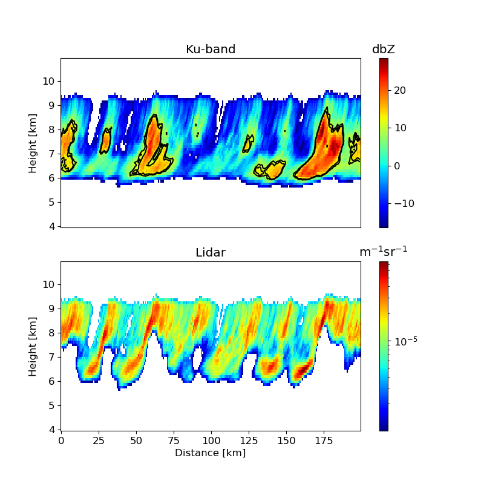
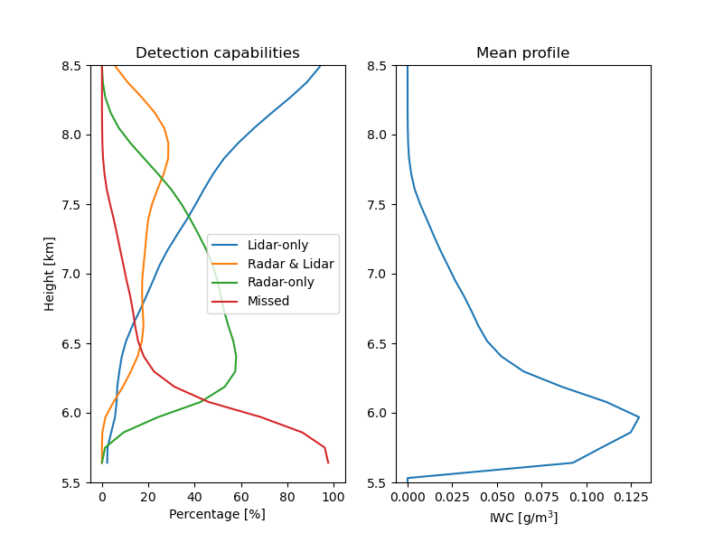

## 1.Introduction ##

The importance of ice clouds in Earth's radiative budget has been long recognized (Liou 1986).  As a consequence, they have been systematically investigated and signficant effort was devoted to their representation in global circulation models. Despite this, clouds in general and ice clouds in particular remain one of the greatest source of uncertainty in climate projections (Schneider et al. 2017). To better understand their properties and relation to atmospheric dynamics, various type of satellite passive and active instruments have been developed and deployed in space (Stephens et al. 2002; Platnick et al. 2003). Although these instruments, collected variable information that enable insight into physical processes and the derivation of reliable climatologies, it is expected that new satellite missions featuring new instruments or combinations of instruments provide new insights into the properties of ice. The NASA Atmospheric Observing System (AOS), formulated in alignment with the 2017-2027 decadal survey (DS) of Earth Science and Applications from Space by the National Academies of Sciences, Engineering, and Medicine (Braun et al. 2022) is such a mission. Specifically, AOS is expected to feature instruments capable of providing at the same time information on aerosol, clouds, and precipitation (as well as their dynamics). To achieve its objective, AOS will rely on a satellite in polar orbit and two satellites in inclined orbits (Braun et al. 2022).   The satellites in the inclined orbits are expected to carry, among other instruments, a Ku-band radar and a backscatter lidar.  Although, from the characterization of ice Particle Size Distributions (PSD) perspective, a Ku-band radar is not the optimal complement of a backscatter lidar, it is, nevertheless an extremely insightful instrument as it enables the study of cloud anvils in conjunction with the associated convective phenomena.

In this study, we investigate to estimation of ice cloud properties such as the ice water content and mass mean diameter from combined backscatter lidar and Ku-band radar observations. The estimation methodology is similar to that of Grecu et al. (2018) and consists of derivation of a large database of simulated backscatter lidar and Ku-band radar observations. The database derivation is achieved through the generation of realistic ice clouds and the simulation of the associated backscatter lidar and Ku-band radar observations using accurate physical models. A fast search procedure is carried out to identify entries in the database characterized by simulated observations simular to the actual observations and a statistical analysis procedure is applied to these entries derive ice property estimates (Grecu et al. 2018).  To account for attenuation and multiple scattering addtional numerical features are included in the search and statistical feature.  This will be explained in Section 2. Although various combined lidar-radar estimation already exist, e.g. Donovan et al. (2001), Mitrescu et al. (2005), Delanoe and Hogan (2011),
Tinel et al. (2005), the database approach is adopted in this study due to its robustness and relative simplicity.  Moreover, this approach enables rigorous uncertainty quantifications, which makes the inclusion of additional observations in the estimation framework straightfoward. Its drawbacks are related to its "lazy" nature (Aha 2013) that does not allow for a compact representation of physical knowledge into parameterized models, but its storage into a database.  The evaluation of the retrieval framework and the value of combined backscatter lidar and Ku-band radar observations is carried out using a cross-validation technique (Bates et al. 2021).

The study is organized as follows.  Section 2 contains the description of the estimation and cross-validation methodologies.  Results are presented in Section 3 and a summary and concluding discussions are given in Section 4.

## 2. Estimation and evaluation methodologies ##

As mentioned in section, several methodologies to estimate ice properties from combined lidar-radar observations exist.  Some of these, e.g. Donovan et al. (2001) and Tinel et al. (2005) rely on attenuation correction procedures derived from the integration of the differential equations describing the describing the variation of the observed lidar backscatter with range. Other approaches, e.g. Mitrescu et al. (2005) and Delanoe and Hogan (2011), are based on "on-the-fly" optimization methods that maximize the agreement between physical models that compute lidar and radar observations as a function of various ice property and actual observations while penalizing discrepancies between the estimates and their climatology. An alternative to on-the-fly optimization is the generation of a large database of ice clouds and associated lidar and radar observations prior to the application of estimation algorithm and the derivation of the optimal estimates through an efficient database search.  The methodology, which was applied to, similar problems before, e.g. Kummerow et al. (2015), Grecu et al. (2018), is adopted in this study to investigate the combined value of backscatter lidar and Ku-band radar observations in quantifying ice cloud properties. For the generation of the synthetic observations, we use a stochastic ice cloud model developed by Hogan and Key (2005). This is described next.

## 2.1. Stochastic cloud model and synthetic observations ##

To generate the ice clouds need in the computation of the lidar and radar observations, the three dimensional 3D stochastic cloud model of Hogan and Kew is used. The model generates 3D ice water content random fields as a function of a set of multiple pieces of information that describe: the vertical distribution of ice water content, the wind shear, and the vertical distribution of the power spectrum component.  The ice water content information may be derived from cloud radar observations, while the wind shear iformation may be derived from numerical weather prediction models (or sounding observations). It should be mentioned that instead of using a statistical cloud model driven by information derived from radar observations, one may directly use radar observations.  Nevertheless, there are benefits in using a model rather than observations. Specifically, the model enables the generation of a large number of ice water content fields under various assumptions regarding the wind shear and horizontal exponent of the power spectrum, which mitigates sampling issues that might otherwise occur.

Ice particle size distributions (PSD) are described using a normalized gamma size distribution (Delanoe et al. 2005).  The shape parameter $\mu$ has only a weak impact on the relationships between the lidar and radar bascatter and the ice water content, but to enable for consistency with the assumptions made in other algorithms applicable to Ku-band radar observations (e.g. Grecu et al. 2016), we assume $\mu$=2. The stochastic cloud model produces only ice water content fields.  These fields are complemented with statistically generate profiles of normalized gamma size intercepts, i.e. $N_w$.  Specifically, we attach a $N_w$ profile to every ice water content profiles in the fields generated by the stochastic.  The $N_w$ profiles are computed using

$$ N_w(z)=N_{w,mean}(z)+dN_w(z) $$ {#eq:Nw_eq}

where $N_{w,mean}(z)$ is a mean profile specified based on Hogan et al. (2006), while $dN_w(z)$ is a random component. The random component is determined by generating a profile of independent log-normally distributed with 0.0 and 1.0 logarithmic mean and standard deviation and applying a gaussian smoothing filter (Nixon and Aguado, 2012) with a standard deviation of 300 m. 

The electromagnetic scattering properties are calculated using software scatter-1.1 (Hogan 2019), which is based on the self-similarity Rayleigh-Gans approximation (SSRGA) of Hogan et al. (2017). The SSRGA theory was developed for millimeter-wave calculations and may not be applicable at lidar's wavelength.  Therefore, for lidar calculations we are using the Mie solution of scatter-1.1. Although more accurate calculations based on more realistic ice particle shapes exist, they are rather incomplete and not readily available.  Moreover, Wagner and Deleny (2022) compared lidar backscatter observations with backscatter calculations based on coincident PSD observations and the Mie solution and found good agreement, which suggests that electromagnetic properties derived from Mie calculations are adequate for practical applications. The lidar molecular backscatter and extinction are calculated using the lidar module of COSP stands for CFMIP Observation Simulator Package (COSP; Bodas-Salcedo et al. 2011).  To account for multiple-scattering in the lidar observations, we are using the multiscatter-1.2.11 model (Hogan 2015) of Hogan and Battaglia (2008).

Shown in Fig. 1 are two cross-sections through the fields of simulated Ku-band radar reflectivity and lidar backscatter. As apparent in the figure, the lidar backscatter observations are affected by significant attenuation. At the same time, a Ku-band radar with a sensitivity of 10 dBZ, would not detect a large portion of the ice cloud detected by the lidar, but it would detect the regions of the cloud where the lidar signal attenuates. This complementary and fact that Ku-band radars provide much better insight into convective process than higher-frequency radars make the lidar and Ku-band radar instrument combination relevant to the AOS mission.

{ width=75% height=75% }

{ width=75% height=75% }

### _References_ ###

*    Aha, D.(29 June 2013). Lazy Learning (illustrated ed.). Springer Science & Business Media, 2013. p. 424. ISBN 978-9401720533
*    Bates, S., Hastie, T. and Tibshirani, R., 2021. Cross-validation: what does it estimate and how well does it do it?. arXiv preprint arXiv:2104.00673.
*    Bodas-Salcedo, A., Webb, M. J., Bony, S., Chepfer, H., Dufresne, J., Klein, S. A., Zhang, Y., Marchand, R., Haynes, J. M., Pincus, R., & John, V. O. (2011). COSP: Satellite simulation software for model assessment, Bulletin of the American Meteorological Society, 92(8), 1023-1043. Retrieved Jul 3, 2022, from https://journals.ametsoc.org/view/journals/bams/92/8/2011bams2856_1.xml
*    Braun and co-authors, 2022. Aerosol, Cloud, Convection, and Precipitation (ACCP) Science and Applications https://aos.gsfc.nasa.gov/docs/ACCP_Science_Narrative-(March2022).pdf
*    Delanoe, J. and Hogan, R.J., 2010. Combined CloudSat-CALIPSO-MODIS retrievals of the properties of ice clouds. Journal of Geophysical Research: Atmospheres, 115(D4).
*    Donovan, D. P., A. C. A. P. van Lammeren, H. W. J. Russchenberg,A. Apituley, R. J. Hogan, P. N. Francis, J. Testud, J. Pelon, M. Quante,and J. W. F. Goddard (2001), Cloud effective particles size and watercontent profile retrievals using ombined radar and lidar observations:2. Comparison with IR radiometer and in-situ measurements of iceclouds,J. Geophys. Res.,106, 27,449–27,464.
*    Grecu, M., Tian, L., Heymsfield, G. M., Tokay, A., Olson, W. S., Heymsfield, A. J., and Bansemer, A. (2018). Nonparametric Methodology to Estimate Precipitating Ice from Multiple-Frequency Radar Reflectivity Observations, Journal of Applied Meteorology and Climatology, 57(11), 2605-2622. Retrieved Jun 30, 2022, from https://journals.ametsoc.org/view/journals/apme/57/11/jamc-d-18-0036.1.xml
*    Hogan, R. J., Mittermaier, M. P., and Illingworth, A. J. (2006). The Retrieval of Ice Water Content from Radar Reflectivity Factor and Temperature and Its Use in Evaluating a Mesoscale Model, Journal of Applied Meteorology and Climatology, 45(2), 301-317. Retrieved Jul 2, 2022, from https://journals.ametsoc.org/view/journals/apme/45/2/jam2340.1.xml
*    Hogan, R. J., and A. Battaglia, 2008: Fast lidar and radar multiple-scattering models: Part 2: Wide-angle scattering using the time-dependent two-stream approximation. J. Atmos. Sci., 65, 3636-3651
*    Hogan, R. J., and S. F. Kew, 2005. A 3D stochastic cloud model for investigating the radiative properties of inhomogeneous cirrus clouds, Q. J. R. Meteorol. Soc., 131, 2585-2608
*    Hogan, R. J. 2015, muliscatter-1.2.11. Retrieved from http://www.met.reading.ac.uk/clouds/multiscatter/multiscatter-1.2.11.tar.gz
*    Hogan, R.J., Honeyager, R., Tyynelä, J. and Kneifel, S., 2017. Calculating the millimetre‐wave scattering phase function of snowflakes using the self‐similar Rayleigh–Gans Approximation. Quarterly Journal of the Royal Meteorological Society, 143(703), pp.834-844.
*    Hogan, R.,J., 2019. scatter-1.1. Retrieved from http://www.met.reading.ac.uk/clouds/ssrga/scatter-1.1.tar.gz
*    Liou, K.N., 1986. Influence of cirrus clouds on weather and climate processes: A global perspective. Monthly Weather Review, 114(6), pp.1167-1199.
*    Mitrescu, C., J. M. Haynes, G. L. Stephens, S. D. Miller, G. M. Heymsfield,and M. J. McGill (2005), Cirrus cloud optical, microphysical, and radia-tive properties observed during the crystal-face experiment: A lidar-radarretrieval system,J. Geophys. Res.,110, D09208, doi:10.1029/2004JD005605
*    Nixon, M. and Aguado, A.S., 2012. Feature extraction & image processing for computer vision. Academic press.
*    Platnick, S., King, M.D., Ackerman, S.A., Menzel, W.P., Baum, B.A., Riédi, J.C. and Frey, R.A., 2003. The MODIS cloud products: Algorithms and examples from Terra. IEEE Transactions on geoscience and Remote Sensing, 41(2), pp.459-473.
*    Schneider, T., Teixeira, J., Bretherton, C.S., Brient, F., Pressel, K.G., Schär, C. and Siebesma, A.P., 2017. Climate goals and computing the future of clouds. Nature Climate Change, 7(1), pp.3-5.
*    Stephens, Graeme L.; Vane, Deborah G.; Boain, Ronald J.; Mace, Gerald G.; Sassen, Kenneth; Wang, Zhien; Illingworth, Anthony J.; O'connor, Ewan J.; Rossow, William B.; Durden, Stephen L.; Miller, Steven D.; Austin, Richard T.; Benedetti, Angela; Mitrescu, Cristian (2002). "THE CLOUDSAT MISSION AND THE A-TRAIN: A New Dimension of Space-Based Observations of Clouds and Precipitation". Bulletin of the American Meteorological Society. 83 (12): 1771–1790. doi:10.1175/BAMS-83-12-1771. ISSN 0003-0007.
*    Tinel, C., J. Testud, R. J. Hogan, A. Protat, J. Delanoë, and D. Bouniol(2005), The retrieval of ice cloud properties from cloud radar and lidarsynergy,J. Appl. Meteorol.,44, 860–875.
*     Wagner, S. W. and Delene, D. J.: Technique for comparison of backscatter coefficients derived from in-situ cloud probe measurements with concurrent airborne Lidar, Atmos. Meas. Tech. Discuss. [preprint], https://doi.org/10.5194/amt-2022-87, in review, 2022. 